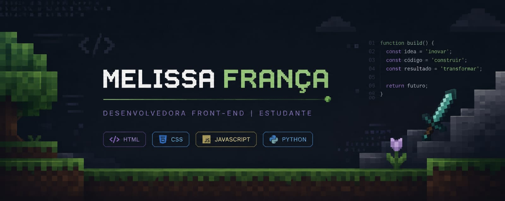

<h1 data-importer="text" align="center">Opa, pode me chamar de Mel!</h1>
<h5 data-importer="text" align="center">Conecte-se comigo!</h5>

  
  
  

 

## 👩‍💻 Sobre mim

Tenho 19 anos e sou estudante de Análise e Desenvolvimento de Sistemas, construindo minha trajetória no desenvolvimento front-end.

Tenho interesse em desenvolvimento web, interfaces modernas, performance e boas práticas de programação. Gosto de criar interfaces que sejam funcionais e bem organizadas, e estou sempre buscando aprender novas tecnologias.

Busco minha primeira oportunidade na área da tecnologia para aplicar meus conhecimentos, contribuir com projetos reais e continuar evoluindo profissionalmente.

 

## 🔭 Atualmente

- 📚 Estudando **Análise e Desenvolvimento de Sistemas**
- 💻 Aprofundando conhecimentos em **front-end** (HTML, CSS, JavaScript)
- 🎯 Em busca da minha **primeira oportunidade** na área de tecnologia
- 🌱 Aprendendo **TypeScript** e boas práticas de código

 

## 🛠️ Linguagens e Tecnologias

  
  
  
  
  
  
  
  
  
  
  
  
  
  
  

 

## 📊 Estatísticas do GitHub

  
  

 

## 🎮 Contribuições

<picture data-importer="pacman">
  <source media="(prefers-color-scheme: dark)" srcset="https://raw.githubusercontent.com/melissaandfranc/melissaandfranc/pacman-output/pacman-contribution-graph-dark.svg?game=pacman">
  <source media="(prefers-color-scheme: light)" srcset="https://raw.githubusercontent.com/melissaandfranc/melissaandfranc/pacman-output/pacman-contribution-graph.svg?game=pacman">
  
</picture>

